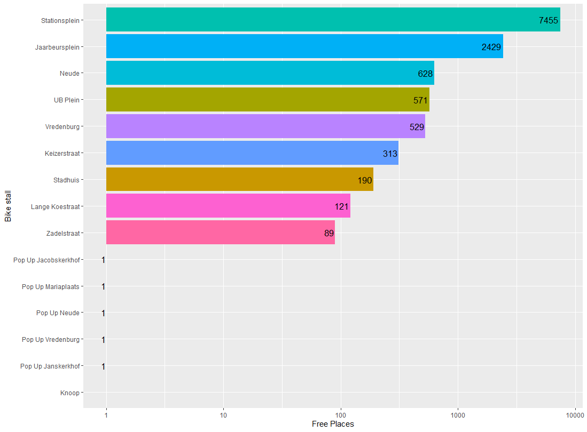

Bike parking has always been a problem in Utrecht. So, it is no surprise the municipality has invested in a system which keeps track of open spots in the bike parking facilities. As it turns out this data is easily accessible through a JSON API. A perfect opportunity to practice data visualization with R, I thought. I will walk through the steps I made step by step. However, if you just want to see the whole script, [click here](#script).

### Loading libraries and getting the JSON

First source the necessary libraries:

```R
require(RJSONIO)  # To process JSON
require(RCurl)    # For getting the data
require(plyr)     # For rbind.
require(ggplot2)  # Used for plotting
```

We will use the function `getURL()` from the `Rcurl` library to grab the JSON. Next, the JSON will be de-serialized, so we can use its contents in R. Fun fact: the [/2/ API endpoint](https://stallingsnet.nl/api/2/parkingcount/utrecht) also outputs if the bike stall is currently open. For now, we will just get the numbers.

```R
raw = getURL('https://stallingsnet.nl/api/1/parkingcount/utrecht')
data.json = fromJSON(raw)
```

### Processing the data

#### Converting to a data frame

Now this is where it gets tricky. First, we need to convert the de-serialized JSON to a data frame. The `fromJSON()` function returns a list of lists. The major list consisting of each data object, representing the rows of the data frame. The smaller lists inside the major list hold the column values for each row within the data frame. So, we will need to create a data frame from each 'row' and join these together. If the three-dimensional layout of the data still isn't clear, see the example below.

```
      Minor
      ------>
M |  |--|--|--|--|--|
a |  |  |  |  |  |  |
j v  |--|--|--|--|--|
o    |  |  |  |  |  |
r    |--|--|--|--|--|
```

To join the rows from the major list into a single data frame we will be using the `rbind.fill()` function from the `plyr` package and the `lapply()` function. `lapply()` applies a function to every element in a list. We will use this to convert each 'row' to a data frame. We will then use `rbind.fill()` to join the data frames as if they were rows in a bigger data frame. This all comes down to the following:

```R
data <- do.call("rbind.fill", lapply(data.json, as.data.frame))

# This is the same
data <- rbind.fill(lapply(data.json, as.data.frame))
```

#### Sanitizing the data

All right! now we can get down to business. First let's have a look at our dataset. We will use the `head()` function to show the top rows of the data we just created. (the 3 indicates we only want the first three rows. The function defaults to six rows.)

```R
head(data, 3)
```

| facilityName       | time                           | totalPlaces | freePlaces | occupiedPlaces |
| :----------------- | :----------------------------- | ----------: | ---------: | -------------: |
| Pop Up Janskerkhof | 2020-06-08T17:32:43.718784055Z |           1 |          1 |              0 |
| Pop Up Vredenburg  | 2020-06-08T17:32:43.718784055Z |           1 |          1 |              0 |
| Knoop Laag         | 2020-06-08T17:32:43.718784055Z |        2926 |          0 |           2926 |

As can be seen from the output above, the dataset contains rows with "Hoog" and "Laag" appended to the bike stalls' names. This is to represent the High and Low bike spaces in the rack, respectively. This data isn't important to us now, so we will drop the rows as follows.

```R
# Remove all rows containing "Hoog"
pruned_data = data[- grep("Hoog", data$facilityName),]
# Remove all rows containing "Laag"
pruned_data = pruned_data[!grepl("Laag", pruned_data$facilityName),]
```

As you can see, we first create a vector (variable) `pruned_data` and assign it to data minus (-) the rows (first argument in the square brackets) containing "Hoog". This matching is done with the `grep()` function, which only returns the matches it has found in the vector you wanted it to search in. In this case `data$facilityName`.

In the second line we use a different approach. This is just for illustrative purposes; you could just as well use the same method used in the the first line. The second method takes `pruned_data` and selects all rows which do _not_ (`!`) match "Laag" This cannot be done with `grep()`, as it just returns the matching rows. `grepl()`, however, returns either a `TRUE` for a match or a `FALSE` for a non-match.

### Plotting the data

Finally, we can plot our data and see the result of our labour. we will use the `ggplot2` packages for this. we will use the following code:

```R
ggplot(data = pruned_data,
       aes(
         # To sort the graph Biggest to smallest
         x = reorder(facilityName, freePlaces),
           y = freePlaces,
           fill = facilityName,
           label = freePlaces)) +
  # Remove the color legend, as it is superfluous
  guides(fill=FALSE) +
  geom_col() +
  # Stack columns hotizontaly
  coord_flip() +
  xlab("Bike stall") +
  ylab("Free Places") +
  # Use a 10log scale, to flatten the peaks
  scale_y_continuous(trans = "log10") +
  # Add exact numbers in the columns
  geom_text(color = "Black", size = 4.5, hjust = 1.1)

```

Now, let's break it down. First, we invoke ggplot and tell it to use the dataset we created (`pruned_data` in this case). We then pass it the `aes()` function as an argument to:

- Pass to ggplot which variable will be the x and y variable, respectively
- Sort the dataset by the number of free places (with the `reorder()` function)
  - Fill the columns with a different color for each facility
- Create labels for each column containing the amount of free places

Next, we remove the color legend with `guides(fill=FALSE)`, as it adds no information to our graph Using `geom_col()` we tell ggplot we want it to output columns. Since, if we would not have specified `geom_col()`, ggplot would have output a scatter plot. The graph's axes are then flipped with `coord_flip()` to make the columns stack horizontally. The y- and x-axes are given an appropriate label. (Remember they are flipped, so `xlab()` labels the y-axis and vice versa!) And the y-axis is transformed to a log10 scale, to flatten the peaks in this graph. We don't need to do this, but it looks a lot nicer and gives a slightly larger resolution as the bike stall at Utrecht Central station is significantly larger than the others. Finally, we instruct R to draw the labels we specified in the `aes()` function and move them slightly to the left with the `hjust` parameter.

Running the entire script will output a graph like this one:

<div class="max-w-lg mx-auto">
<figure>

<figcaption>
A plot of the available bike spots in the municipal bike stalls in Utrecht. A value of 1 means the stall is currently closed. Notice the x-axis follows a <sub>10</sub>log scale
</figcaption>
</figure>
</div>

### The complete script

<span id="script"></span>

```R
require(RJSONIO)  # To process JSON
require(RCurl)    # For getting the data
require(plyr)     # For rbind.
require(ggplot2)  # Used for plotting

raw = getURL('https://stallingsnet.nl/api/1/parkingcount/utrecht')
data.json = fromJSON(raw)
data <- do.call("rbind.fill", lapply(data.json, as.data.frame))
pruned_data = data[- grep("Hoog", data$facilityName),]
pruned_data = pruned_data[!grepl("Laag", pruned_data$facilityName),]

ggplot(data = pruned_data,
       aes(
         # To sort the graph Biggest to smallest
         x = reorder(facilityName, freePlaces),
           y = freePlaces,
           fill = facilityName,
           label = freePlaces)) +
  # Remove the color legend, as it is superfluous
  guides(fill=FALSE) +
  geom_col() +
  # Stack columns hotizontaly
  coord_flip() +
  xlab("Bike stall") +
  ylab("Free Places") +
  # Use a 10log scale, to flatten the peaks
  scale_y_continuous(trans = "log10") +
  # Add exact numbers in the columns
  geom_text(color = "Black", size = 4.5, hjust = 1.1)

```

### Conclusions

I hope you have found this post useful. I learned a lot about both R and ggplot during this little project. Some next steps could have been to exclude rows if the bike stall was closed, but i have spent a lot of time on this side project as is. If you improved on my code or have a question, feel free to [drop me a message](/contact)
